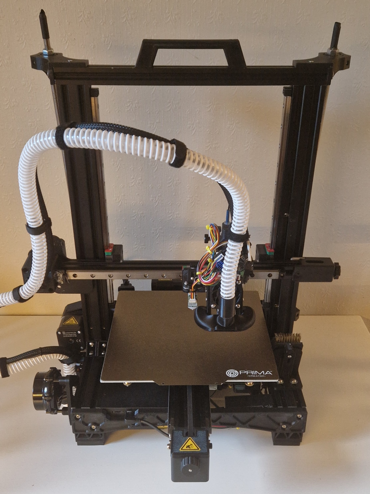

# ProtoZoomyEnder

A repository for one of my personal 3D printers used as a learning/research project.

> Originally a Creality Ender 3 (v2) I got super cheap second hand.

## About

Main features:

* Linear rails with belt drive on all axes
* High torque stepper motors
* High flow direct drive extruder system
* CPAP cooling
* CAN bus communication
* Compatible with most filaments

Uses portions of designs from the following projects:

* LDO BeltEnder Motion System (Beta 2) [^1]
* Hero Me Toolhead (Gen 7) [^2]
* Universal Frame Stiffener [^3]

Runs on Klipper firmware with the following features:

* Bed Meshes
* Firmware Retraction
* Pressure Advance
* Resonance Compensation
* Object Exclusion
* Custom Filament Macros

Demos:

* [10 min benchy](https://www.youtube.com/watch?v=wyJpjxVNcEQ)

## TODO

* Set up CANboot
* Install Rapido Plus block (PT1000 / 350C max)
* Calibrate Square Corner Velocity (`jerk * sqrt(2)`)
* Custom `CANCEL_PRINT` gcode macro
* Custom `M600` (automatic filament change) gcode macro
* Create an Enraged Rabbit!

[^1]: https://www.orbiterprojects.com/beltender-linear-rail-upgrade-for-ender-printers/
[^2]: https://www.printables.com/model/39322-hero-me-gen-7-platform-release-4
[^3]: https://www.printables.com/model/22099-universal-frame-stiffener-for-geeetech-a20-a30-cre
