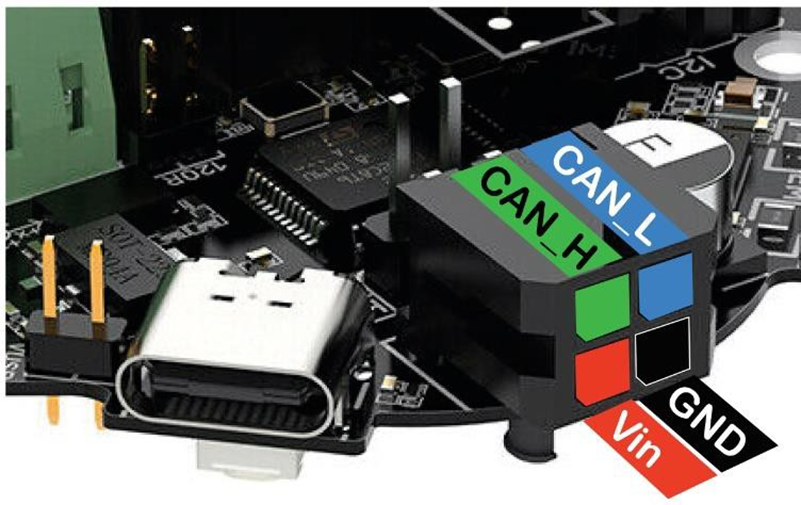
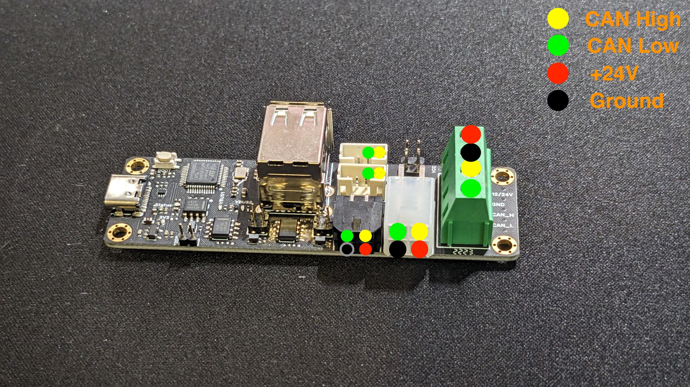

# CANBus Setup

Using the BTT EBB36 v1.2 and BTT U2C v2.1.

> **NB**: A lot of documentation says to configure for 1500000 baud rate,
> but according to the official spesifications this should be **250000**!

## Hardware

Connector on the EBB36 [^1]:



Connector on the U2C [^2]:



## Interface

Put the following into `/etc/network/interfaces.d/can0` and reboot:

```
allow-hotplug can0
iface can0 can static
 bitrate 250000
 up ifconfig $IFACE txqueuelen 256
 pre-up ip link set can0 type can bitrate 250000
 pre-up ip link set can0 txqueuelen 256
```

## Firmware

The EBB module requires flashing. Inside the `~/klipper` directory.

### Building

Run `make menuconfig` to configure the hardware.

```
[*] Enable extra low-level configuration options
Micro-controller Architecture ---> STMicroelectronics STM32
Processor model ---> STM32G0B1
Bootloader offset ---> No bootloader
Clock Reference ---> 8 MHz crystal
Communication interface CAN bus ---> PB0/PB1
(250000) CAN bus speed
```

Then `make`.

### Flash

Connect a USB-C to USB-A cable and put a jumper onto `VUSB` to power from 5V.

> **Don't have 24V connected and powered as entering DFU mode pulls down a pin shared with the heater**.

> Remember to remove the jumper when finished. Also note that after flashing to CAN the device will no longer
> report as a USB device when not in DFU mode (even when jumper is connected).

Hold down the `BOOT` button and press `RESET` button once to enter DFU mode.

Then flash the build with:

> Ignore the `Error during download get_status` error as this is just a side-effect
> from the device rebooting after flash and is no longer in DFU mode. As long as
> the output says `File downloaded successfully` everything is OK.

```bash
make flash FLASH_DEVICE=0483:df11

# Or alternatively with dfu-util
sudo dfu-util -d ,0483:df11 -R -a 0 -s 0x8000000:leave -D out/klipper.bin
```

## Klipper

First identify your EBB module CAN id:

```bash
~/klippy-env/bin/python ~/klipper/scripts/canbus_query.py can0
```

Samples can be found at https://github.com/bigtreetech/EBB

[^1]: Credit: https://lab4450.com/product/ebb36/
[^2]: Credit: https://wiki.kb-3d.com/en/home/btt/voron/u2c_v2
