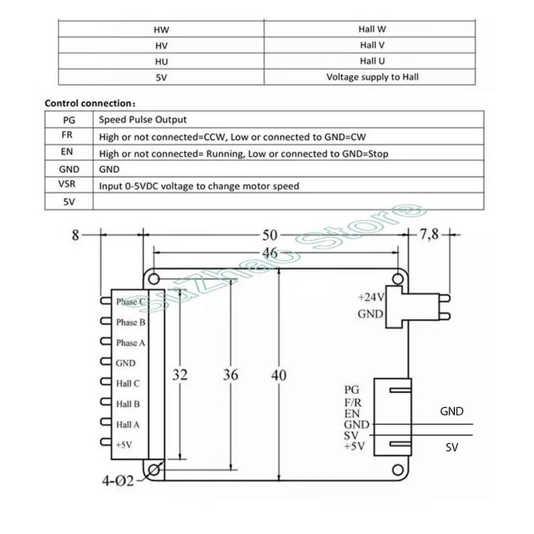

# CPAP Cooling

General information about setting up the Mellow 7040 CPAP & Controller on Klipper with PWM.

## Wiring



### Printer mainboard

* Extend the `+24V` / `GND` wires to the printer PSU
* Connect `SV` to a **5V PWM** controlled pin

### Raspberry Pi

> If you're connecting to a Pi with an isolated power supply then you need to connect
> the `GND` signal next to `SV` to a ground pin on the Pi.

* Extend the `+24V` / `GND` wires to the printer PSU
* Connect `SV` to an arbitrary GPIO pin, i.e. `gpio26`

## Configuration

Fill in the pin used on your setup, i.e.: `rpi:gpio26`:

```
[fan]
pin: <pin here>
cycle_time: 0.005
shutdown_speed: 0
hardware_pwm: False
```
