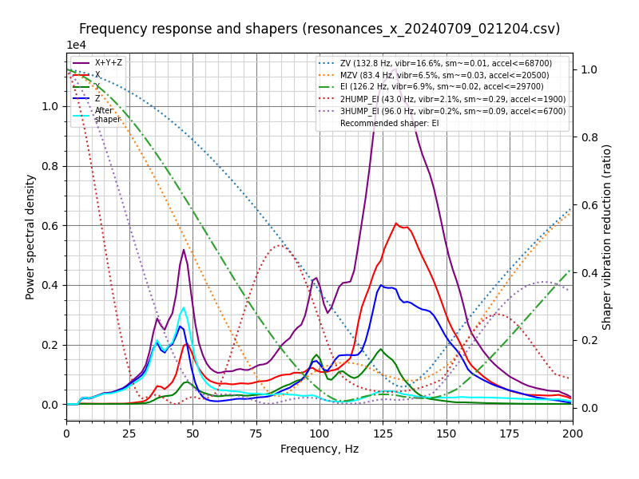
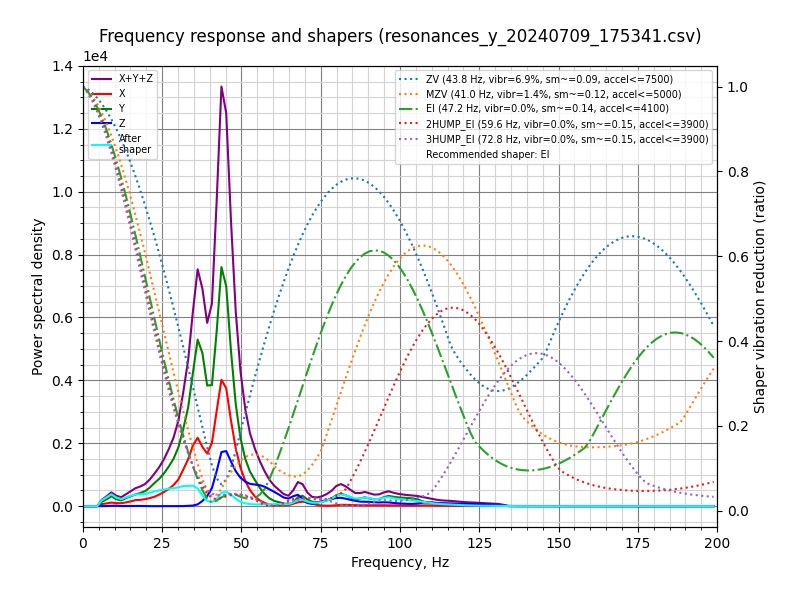

# Resonances

Measured using ADXL345 over SPI on a Pico running as separate MCU.

> Printer rests on a 35mm thick concrete slab with a 20mm thick foam dampening sheet.

## X-Axis



```
Fitted shaper 'zv' frequency = 132.8 Hz (vibrations = 16.6%, smoothing ~= 0.014)
To avoid too much smoothing with 'zv', suggested max_accel <= 68700 mm/sec^2
Fitted shaper 'mzv' frequency = 83.4 Hz (vibrations = 6.5%, smoothing ~= 0.032)
To avoid too much smoothing with 'mzv', suggested max_accel <= 20500 mm/sec^2
Fitted shaper 'ei' frequency = 126.2 Hz (vibrations = 6.9%, smoothing ~= 0.023)
To avoid too much smoothing with 'ei', suggested max_accel <= 29700 mm/sec^2
Fitted shaper '2hump_ei' frequency = 43.0 Hz (vibrations = 2.1%, smoothing ~= 0.292)
To avoid too much smoothing with '2hump_ei', suggested max_accel <= 1900 mm/sec^2
Fitted shaper '3hump_ei' frequency = 96.0 Hz (vibrations = 0.2%, smoothing ~= 0.089)
To avoid too much smoothing with '3hump_ei', suggested max_accel <= 6700 mm/sec^2
Recommended shaper is ei @ 126.2 Hz
```

## Y-Axis



```
Fitted shaper 'zv' frequency = 43.8 Hz (vibrations = 6.9%, smoothing ~= 0.085)
To avoid too much smoothing with 'zv', suggested max_accel <= 7500 mm/sec^2
Fitted shaper 'mzv' frequency = 41.0 Hz (vibrations = 1.4%, smoothing ~= 0.121)
To avoid too much smoothing with 'mzv', suggested max_accel <= 5000 mm/sec^2
Fitted shaper 'ei' frequency = 47.2 Hz (vibrations = 0.0%, smoothing ~= 0.145)
To avoid too much smoothing with 'ei', suggested max_accel <= 4100 mm/sec^2
Fitted shaper '2hump_ei' frequency = 59.6 Hz (vibrations = 0.0%, smoothing ~= 0.152)
To avoid too much smoothing with '2hump_ei', suggested max_accel <= 3900 mm/sec^2
Fitted shaper '3hump_ei' frequency = 72.8 Hz (vibrations = 0.0%, smoothing ~= 0.155)
To avoid too much smoothing with '3hump_ei', suggested max_accel <= 3900 mm/sec^2
Recommended shaper is ei @ 47.2 Hz
```
