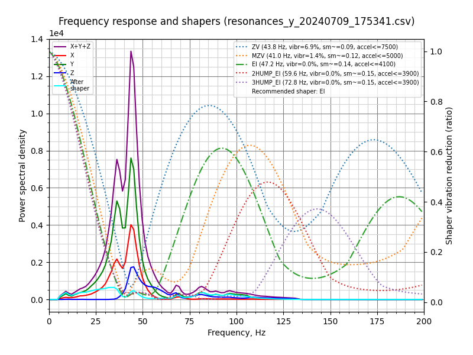

# Resonances

Measured using ADXL345 over SPI on a Pico running as separate MCU.

> Printer rests on a 35mm thick concrete slab with a 20mm thick foam dampening sheet.

## X-Axis


```
Fitted shaper 'zv' frequency = 39.0 Hz (vibrations = 14.1%, smoothing ~= 0.105)
To avoid too much smoothing with 'zv', suggested max_accel <= 5900 mm/sec^2
Fitted shaper 'mzv' frequency = 28.6 Hz (vibrations = 4.2%, smoothing ~= 0.249)
To avoid too much smoothing with 'mzv', suggested max_accel <= 2400 mm/sec^2
Fitted shaper 'ei' frequency = 37.8 Hz (vibrations = 1.3%, smoothing ~= 0.225)
To avoid too much smoothing with 'ei', suggested max_accel <= 2700 mm/sec^2
Fitted shaper '2hump_ei' frequency = 39.0 Hz (vibrations = 0.0%, smoothing ~= 0.355)
To avoid too much smoothing with '2hump_ei', suggested max_accel <= 1500 mm/sec^2
Fitted shaper '3hump_ei' frequency = 80.4 Hz (vibrations = 2.0%, smoothing ~= 0.127)
To avoid too much smoothing with '3hump_ei', suggested max_accel <= 4700 mm/sec^2
Recommended shaper is 3hump_ei @ 80.4 Hz
```

## Y-Axis



```
Fitted shaper 'zv' frequency = 40.6 Hz (vibrations = 3.2%, smoothing ~= 0.098)
To avoid too much smoothing with 'zv', suggested max_accel <= 6400 mm/sec^2
Fitted shaper 'mzv' frequency = 40.4 Hz (vibrations = 0.0%, smoothing ~= 0.125)
To avoid too much smoothing with 'mzv', suggested max_accel <= 4800 mm/sec^2
Fitted shaper 'ei' frequency = 48.6 Hz (vibrations = 0.0%, smoothing ~= 0.136)
To avoid too much smoothing with 'ei', suggested max_accel <= 4400 mm/sec^2
Fitted shaper '2hump_ei' frequency = 60.8 Hz (vibrations = 0.0%, smoothing ~= 0.146)
To avoid too much smoothing with '2hump_ei', suggested max_accel <= 4100 mm/sec^2
Fitted shaper '3hump_ei' frequency = 73.4 Hz (vibrations = 0.0%, smoothing ~= 0.152)
To avoid too much smoothing with '3hump_ei', suggested max_accel <= 3900 mm/sec^2
Recommended shaper is mzv @ 40.4 Hz
```
