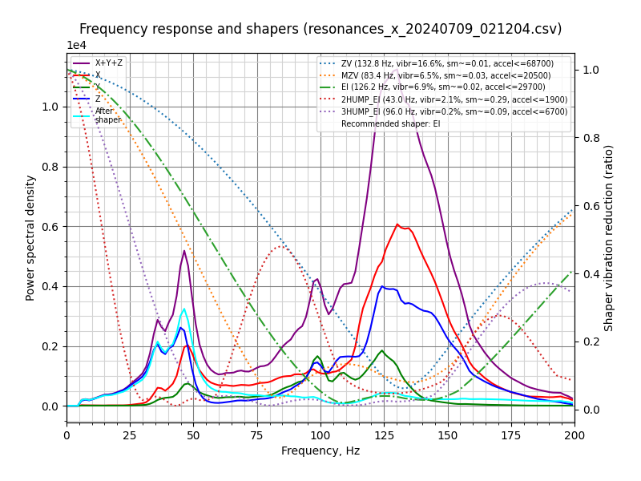

# Resonances

Measured using ADXL345 over SPI on a Pico running as separate MCU.

> Printer rests on a 35mm thick concrete slab with a 20mm thick foam dampening sheet.

## X-Axis



```
Fitted shaper 'zv' frequency = 40.8 Hz (vibrations = 19.9%, smoothing ~= 0.097)
To avoid too much smoothing with 'zv', suggested max_accel <= 6500 mm/sec^2
Fitted shaper 'mzv' frequency = 28.8 Hz (vibrations = 5.9%, smoothing ~= 0.246)
To avoid too much smoothing with 'mzv', suggested max_accel <= 2400 mm/sec^2
Fitted shaper 'ei' frequency = 37.4 Hz (vibrations = 2.7%, smoothing ~= 0.230)
To avoid too much smoothing with 'ei', suggested max_accel <= 2600 mm/sec^2
Fitted shaper '2hump_ei' frequency = 39.0 Hz (vibrations = 0.3%, smoothing ~= 0.355)
To avoid too much smoothing with '2hump_ei', suggested max_accel <= 1500 mm/sec^2
Fitted shaper '3hump_ei' frequency = 81.6 Hz (vibrations = 2.2%, smoothing ~= 0.123)
To avoid too much smoothing with '3hump_ei', suggested max_accel <= 4900 mm/sec^2
Recommended shaper is 3hump_ei @ 81.6 Hz
```

## Y-Axis


```
Fitted shaper 'zv' frequency = 41.0 Hz (vibrations = 4.8%, smoothing ~= 0.096)
To avoid too much smoothing with 'zv', suggested max_accel <= 6600 mm/sec^2
Fitted shaper 'mzv' frequency = 40.0 Hz (vibrations = 0.3%, smoothing ~= 0.127)
To avoid too much smoothing with 'mzv', suggested max_accel <= 4700 mm/sec^2
Fitted shaper 'ei' frequency = 47.2 Hz (vibrations = 0.0%, smoothing ~= 0.145)
To avoid too much smoothing with 'ei', suggested max_accel <= 4100 mm/sec^2
Fitted shaper '2hump_ei' frequency = 59.4 Hz (vibrations = 0.0%, smoothing ~= 0.153)
To avoid too much smoothing with '2hump_ei', suggested max_accel <= 3900 mm/sec^2
Fitted shaper '3hump_ei' frequency = 72.2 Hz (vibrations = 0.0%, smoothing ~= 0.157)
To avoid too much smoothing with '3hump_ei', suggested max_accel <= 3800 mm/sec^2
Recommended shaper is mzv @ 40.0 Hz
```
